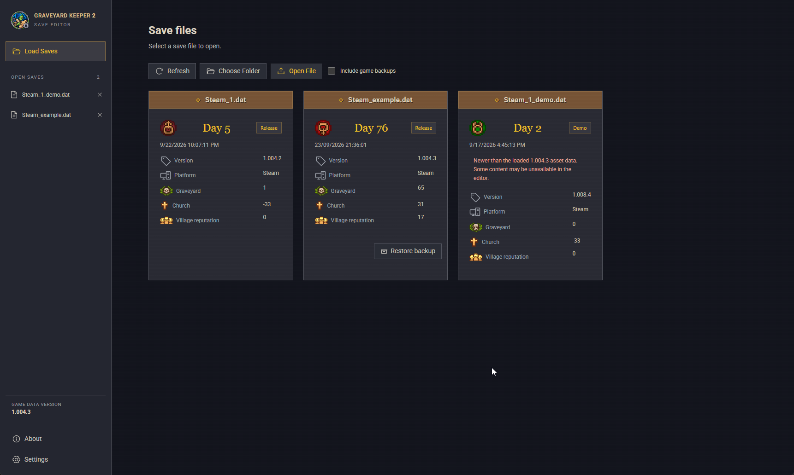
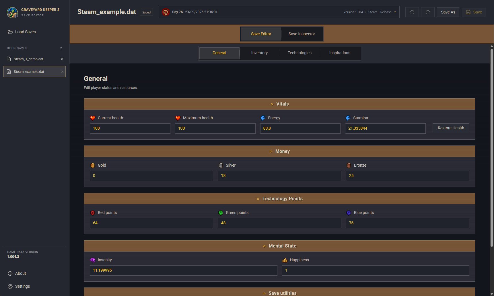
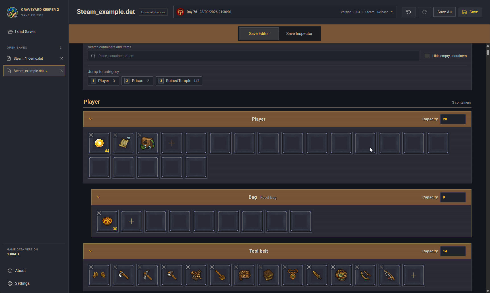
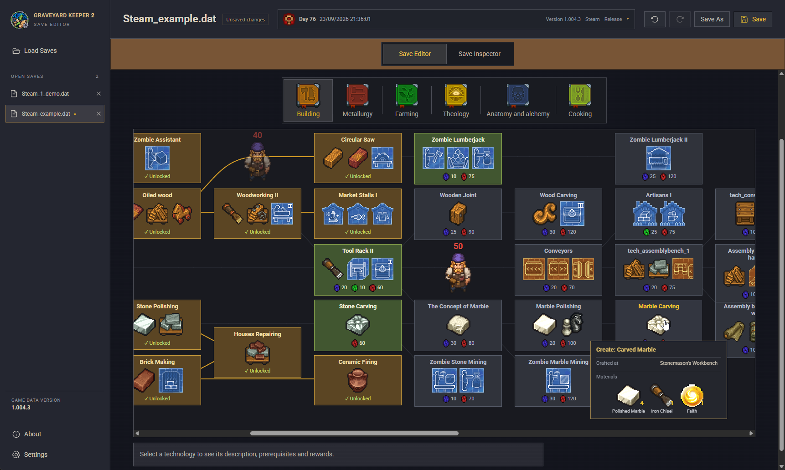
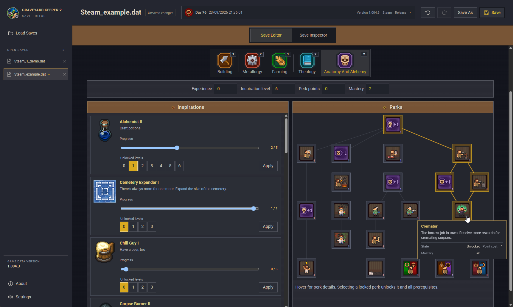
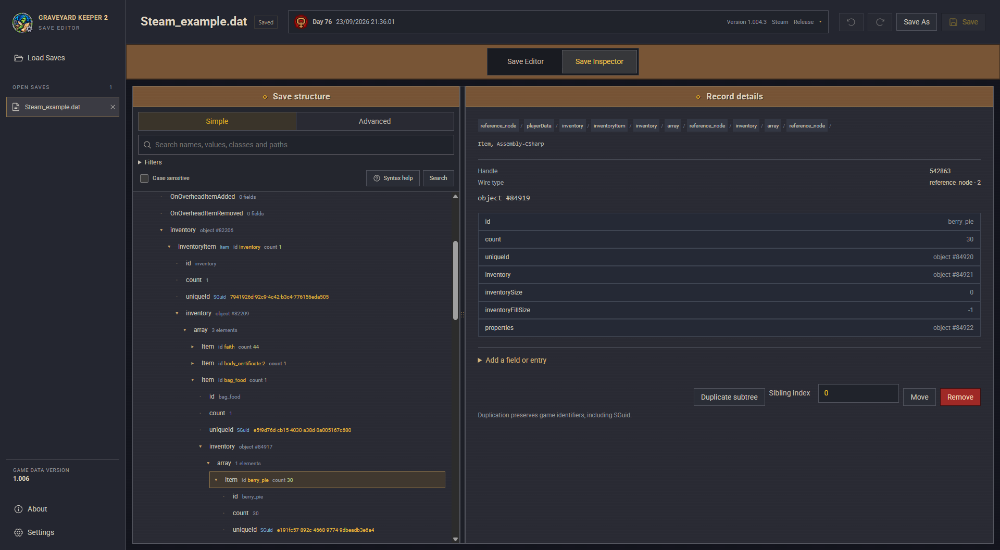
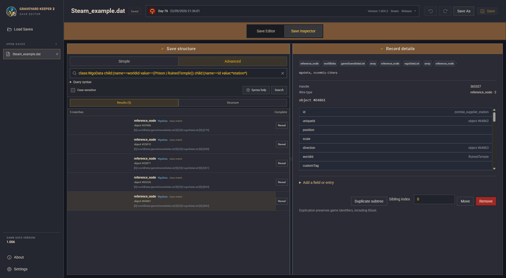

# Graveyard Keeper 2 Save Editor

An unofficial save editor for **Graveyard Keeper 2**. It can edit player values,
manage supported inventories, undo changes, and inspect data that does not yet
have a dedicated editor.

The editor runs on your own device. The web version processes saves in your
browser and does not upload them to a server.

## Use the editor

### Web version

[Open the Graveyard Keeper 2 Save Editor](https://netroscript.github.io/graveyard-keeper-2-savegame-editor/)

Choose your `.dat` save and its matching `.info` file when available. The edited
save is downloaded as a new file, leaving the original untouched.

The web editor cannot create or manage backups in the game's save folder. Keep
the original `.dat` and matching `.info` files until you have confirmed the edited
save works in the game. Use the desktop version if you want save discovery,
automatic paired backups, and protection against overwriting a save changed by
the game or another program.

### Desktop version

Download the version for your operating system from the
[GitHub Releases page](https://github.com/NetroScript/graveyard-keeper-2-savegame-editor/releases).

The desktop application can find saves automatically. Before replacing a save,
it creates a compressed ZIP backup containing its `.dat` and `.info` files by
default; the number of retained backups is configurable in Settings. Earlier
versions can be restored from the save list. It also detects if another program
changed a save and can install signed application updates. On Windows, use the
installer if you want automatic updates. Linux downloads include `.deb` and
`.rpm` packages, an executable archive that uses system WebKitGTK, and an
AppImage. Portable downloads also include a standalone `.exe` for Windows and
compressed application bundles for both macOS architectures.

The Windows portable executable can be run without installation, but accepting
an automatic update launches the installer and changes it into an installed
application. Download and replace the portable executable manually if it should
remain portable. Portable macOS and Linux updates require the application bundle
or AppImage to be in a location the current user can modify.

The editor checks the save structure, but only the game can confirm that every
edited value is valid for a particular game version. Keep the desktop backup, or
your own backup when using the web editor, until the edited save has loaded
successfully.

#### Linux

On Debian/Ubuntu, use the `.deb` package; on Fedora, use the `.rpm` package.
These use your system's WebKitGTK and avoid the AppImage's forced X11 backend.

The AppImage bundles the WebKitGTK version from the build environment, and its
launcher forces the X11 backend even in a Wayland session. This AppImage was
laggy on an NVIDIA/Wayland system where the system WebKitGTK path ran more
smoothly. Setting `GDK_BACKEND=wayland` in the shell cannot override the
AppImage launcher. If it feels slow, try a native package or the executable
archive. The archive is intended for distributions such as Arch Linux and
requires compatible system libraries, including WebKitGTK 4.1. Extract it, run
`graveyard-keeper-2-savegame-editor`, and download a new archive to update it.

On some NVIDIA Wayland systems, the executable from the archive may need
`__NV_DISABLE_EXPLICIT_SYNC=1` to start. This was required on the system tested
here. From the directory where you extracted it, run:

```sh
__NV_DISABLE_EXPLICIT_SYNC=1 ./graveyard-keeper-2-savegame-editor
```

If none of the Linux downloads works on your system, use the
[web editor](#web-version) or build the desktop executable locally with
`pnpm tauri build --no-bundle`.
Building requires Linux Tauri dependencies and `static/assets/game.gk2pack`,
which is not included in Git. See the [build instructions](docs/builds.md) and
[game asset exporter](src-assets/README.md) to prepare a local build.

If `pnpm tauri dev` crashes with `Error 71 (Protocol error)` on NVIDIA Wayland,
try `__NV_DISABLE_EXPLICIT_SYNC=1 pnpm tauri dev`. This resolved the development
crash on the system tested here without disabling the faster rendering path.

## Screenshots

The desktop and web versions share the same editing interface. Click a screenshot
to view it at full size.

| Save discovery and backups                                                                                                                   | General values                                                                                                                                    |
| -------------------------------------------------------------------------------------------------------------------------------------------- | ------------------------------------------------------------------------------------------------------------------------------------------------- |
| [](docs/screenshots/load-saves.png) | [](docs/screenshots/general-editor.png) |

| Inventory, bags, and tool belt                                                                                                               | Technology tree                                                                                                                                       |
| -------------------------------------------------------------------------------------------------------------------------------------------- | ----------------------------------------------------------------------------------------------------------------------------------------------------- |
| [](docs/screenshots/inventory-editor.png) | [](docs/screenshots/technology-tree.png) |

[](docs/screenshots/inspirations.png)

_Inspirations, progression controls, and the perk tree._

| Save Inspector tree and record details                                                                                                       | Save Inspector search and query filtering                                                                                                         |
| -------------------------------------------------------------------------------------------------------------------------------------------- | ------------------------------------------------------------------------------------------------------------------------------------------------- |
| [](docs/screenshots/save-inspector.png) | [](docs/screenshots/save-inspector-search.png) |

## What can be edited

- Health, energy, stamina, money, happiness, insanity, and technology points.
- Player inventory, equipped tool belt, bags, chests, and supported world
  containers. Bags appear beneath the inventory that contains them.
- Item counts, quality variants, durability, capacity, insertion, replacement,
  and removal where the game rules are known.
- Technology trees, including dependency-aware unlocks and the game's rewards.
- Inspiration progress, unlocked levels, talent values, and perk trees.
- Raw save fields and structures through the Save Inspector.
- Undo and redo for accepted edits.

The side rail shows the game version represented by the included asset catalog.
If that version is older than the installed game, definitions or icons may be
outdated even when the save itself still opens.

## Save Inspector

The Save Inspector lets you explore and edit the raw structure of your save
file. It is useful for viewing and changing data that does not have a dedicated
menu yet - such as world objects, scene data, quest flags, and other game
properties.

### Tree browsing and editing

- **Two-panel layout:** Browse the save structure on the left and see the
  details of the selected entry on the right. You can drag the divider to resize
  the panels or use the keyboard (Arrow keys to resize, Home to reset).
- **Smooth navigation:** Large collections of entries load in pages of 200 items
  at a time, keeping the interface snappy. A breadcrumb bar at the top always
  shows your current path in the save hierarchy.
- **Friendly widgets with raw toggle:** Common data types like game GUIDs and
  coordinates have dedicated friendly editors, with a toggle to inspect the raw
  fields whenever you need to.
- **Direct editing:** Modify numbers, booleans, and text directly.
- **Structure editing:** Add new fields or arrays, pick from common templates,
  reorder entries, duplicate subtrees, remove items, or reconnect object
  references.
- **Full undo support:** A dismissible safety banner warns that raw edits can
  corrupt saves. All changes support full undo and redo (`Ctrl+Z` / `Ctrl+Y`),
  letting you easily step back if something goes wrong.

### Searching the save

The inspector includes a fast search to help you track down specific items,
values, or objects across the entire save:

- **Simple and Advanced search:** Simple mode lets you filter by typing a word,
  matching a field name, or picking a numeric range. Advanced mode lets you write
  flexible query expressions.
- **Text & exact matching:** Supports wildcards (like `*iron*`), exact matches
  using `==` (for example `name==worldId` or `value==Prison`), and quoted words.
- **Combining search terms:** Combine conditions with AND (spaces), OR (`|`),
  NOT (`!`), and parentheses `()` for grouping.
- **Numeric ranges:** Filter numbers with comparisons such as `value>=10`,
  `value<=100`, or `value=50`.
- **Relationship filters:** Target containers based on what is inside them using
  `child:(...)`, `descendant:(...)`, or `parent:(...)` queries.
- **Jump to result:** Clicking any search result opens its place in the tree,
  automatically expanding all parent folders and highlighting the matching
  entry.

## Finding saves

Typical release save locations are:

| Platform     | Location                                                                                                                            |
| ------------ | ----------------------------------------------------------------------------------------------------------------------------------- |
| Windows      | `%USERPROFILE%\AppData\LocalLow\Lazy Bear Games\Graveyard Keeper 2`                                                                 |
| macOS        | `~/Library/Application Support/Lazy Bear Games/Graveyard Keeper 2`                                                                  |
| Linux        | `~/.config/unity3d/Lazy Bear Games/Graveyard Keeper 2`                                                                              |
| Steam Proton | `~/.local/share/Steam/steamapps/compatdata/4358690/pfx/drive_c/users/steamuser/AppData/LocalLow/Lazy Bear Games/Graveyard Keeper 2` |

Steam libraries and Linux configuration directories can be stored elsewhere.

## For developers

The project uses Rust for lossless save processing, Svelte for the interface,
WebAssembly for browser builds, and Tauri for desktop builds.

Install Node.js, pnpm and Rust, then run:

```sh
pnpm install
rustup target add wasm32-unknown-unknown
pnpm dev
```

Useful commands:

| Command              | Result                                                           |
| -------------------- | ---------------------------------------------------------------- |
| `pnpm build:web`     | Static browser application in `build/web`                        |
| `pnpm tauri dev`     | Desktop development application                                  |
| `pnpm tauri build`   | Desktop executable and installers for the current platform       |
| `pnpm release:local` | Web and current-platform release files under `release/<version>` |
| `pnpm check`         | TypeScript and Svelte checks                                     |
| `pnpm test:core`     | Rust save-library tests                                          |
| `pnpm test:browser`  | Browser integration tests                                        |

More technical documentation:

- [Release history](CHANGELOG.md)
- [Desktop and browser builds](docs/builds.md)
- [Release builds and updates](docs/releases.md)
- [Save library API](crates/save-core/README.md)
- [Game asset exporter](src-assets/README.md)

## Development

This repository was created with assistance from AI coding agents.

## License and game assets

The editor source code is available under the [MIT License](LICENSE).

The MIT License applies only to the editor's original source code. Graveyard
Keeper 2 and the game artwork and other game assets distributed with the editor
remain the property of Lazy Bear Games and their respective rights holders. No
ownership of, or license to, those assets is claimed, offered, or granted by this
project. Their inclusion does not imply authorization, affiliation, or
endorsement by Lazy Bear Games or any other rights holder.

If Lazy Bear Games or another applicable rights holder requests their removal,
the project maintainers will promptly remove the relevant assets from the hosted
web editor and from future downloadable distributions under their control.
