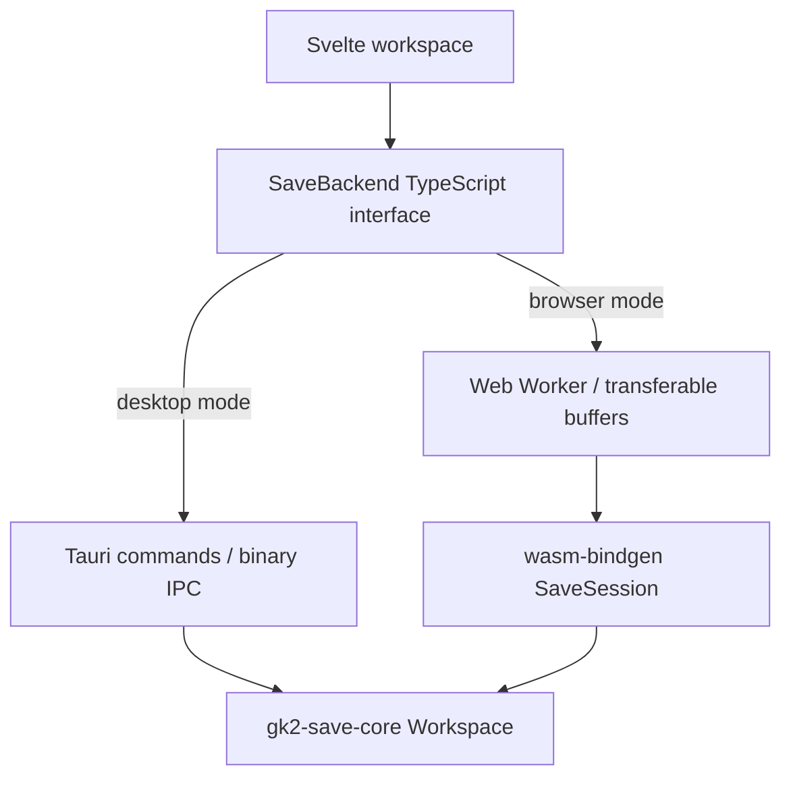

# Desktop and browser builds

Both targets now use the same Rust codec, service operations and Svelte views. Only the transport adapter changes.



## Repository layout

| Location                 | Responsibility                                                                                               |
| ------------------------ | ------------------------------------------------------------------------------------------------------------ |
| `crates/save-core`       | Lossless binary document, validation, inspection, atomic structural edits, General selectors and shared DTOs |
| `crates/save-desktop`    | Native discovery, metadata previews, safe writes and paired backups                                          |
| `crates/save-wasm`       | Thin wasm-bindgen wrapper around the same `Workspace`                                                        |
| `src-tauri/src/lib.rs`   | Tauri commands, native dialogs and mutex-protected desktop workspace                                         |
| `src/lib/save-api.ts`    | One asynchronous frontend interface and transport selection                                                  |
| `src/lib/save-worker.ts` | Ordered WebAssembly requests off the UI thread                                                               |
| `scripts/frontend.mjs`   | Cross-platform build-target environment and Vite mode selection                                              |
| `static/wasm`            | Generated browser module and `.wasm`, ignored by Git                                                         |
| `build/web`              | Deployable static browser site                                                                               |
| `build/desktop`          | Frontend embedded by Tauri                                                                                   |

The root Cargo workspace contains core, desktop filesystem and WebAssembly crates. Tauri remains a separate Cargo project with its existing lockfile, depending on core by path. This avoids making codec tests build the desktop runtime. Commit both lockfiles. The root release profile targets WebAssembly size; Tauri retains its native release profile.

## Shared communication

`SaveBackend` has `open(Uint8Array)`, `request(documentId, command)`, `export(documentId)` and `dispose()`. Components never call Tauri or wasm-bindgen directly. `Workspace` owns independently identified documents; it is held in Tauri application state or a WebAssembly `SaveSession` instance.

- Open/export transfer binary buffers. Tauri uses raw `InvokeBody` and `ipc::Response`; the worker uses transferable `ArrayBuffer`s. This avoids expanding a 13 MB save into a JSON array of numbers.
- Small queries and edits use the same Serde `Command`/transaction shapes. The wasm-bindgen wrapper serializes those DTOs as JSON strings; Tauri serializes them through its normal command channel.
- Child queries are paginated (maximum 200 entries), so browsing does not send the entire 585,394-record test save to Svelte.
- Wire scalar values use strings at the boundary, preserving all 64-bit integer values. The canonical document remains in Rust. Displaying a float as text does not modify its stored bits.
- Requests in the worker are serialized; stale edits are rejected by revision. If startup fails, the UI reports the error. Disposing a browser backend terminates the worker and releases its WebAssembly memory.
- The TypeScript DTO declarations currently mirror the Rust declarations manually. Keep the JSON contract tests updated when changing them; automatic type generation is a future improvement.

This follows Tauri's documented [command and binary IPC mechanisms](https://v2.tauri.app/develop/calling-rust/) and wasm-pack's [web-target module initialization](https://wasm-bindgen.github.io/wasm-pack/book/quickstart.html).

Desktop uses native Open File, Choose Folder and Save As dialogs, automatic discovery, conflict detection and configurable paired backups. Browser uses local file selection/drop and downloads. Both edit the same Rust document model. See [workspace API and extensions](workspace.md) and [style guide](style-guide.md).

## Commands and outputs

```sh
pnpm install
rustup target add wasm32-unknown-unknown
pnpm dev                    # browser, builds WASM first
pnpm build:web              # build/web, static hosting
pnpm preview                # rebuild and serve the browser production build
pnpm tauri dev              # native development application
pnpm tauri build            # native application and installers
pnpm tauri build --no-bundle # native application only
```

`wasm-pack` is a project development dependency, not a required global installation. Its first build downloads helper tools. `pnpm build:wasm` regenerates the module after Rust changes; browser development currently does not watch/rebuild Rust automatically. `tauri dev` handles native rebuilding.

`frontend.mjs` sets `SAVE_BUILD_TARGET` and Vite's `--mode` consistently on Windows/macOS/Linux. Svelte's static adapter writes the appropriate output directory. The TypeScript facade selects the backend at build time using that mode. Run the documented scripts rather than invoking bare Vite with an unrelated mode. `pnpm preview` intentionally rebuilds the browser target first because SvelteKit's preview server uses its most recent intermediate output; otherwise a preceding desktop build could expose Tauri-only calls to a normal browser. Desktop builds do not need a WASM build, although existing generated files under `static/wasm` may also be copied as unused assets by Svelte's static adapter.

Deploy all of `build/web` on a static HTTP(S) host, including the `wasm` directory. Opening `index.html` through `file://` is not supported. For deployment under a subdirectory, configure SvelteKit `kit.paths.base`; the worker's module URL is passed from the frontend using that base. Root-path hosting is covered by current browser tests; subdirectory deployment has not been tested. Browser and desktop outputs are separate, but `.svelte-kit` is a shared intermediate directory: run the two frontend builds sequentially.

## Tests

```sh
pnpm test:core
cargo test -p gk2-save-desktop
pnpm build:wasm
pnpm test:wasm
pnpm check
pnpm exec playwright install chromium
pnpm test:browser
```

Browser tests default to Playwright's headless Chromium, installed with the command above. Optionally set `PLAYWRIGHT_CHANNEL` to an installed browser channel such as `msedge`. There is no dependency on a particular locally installed browser. A synthetic save tests load, edit, download and failure recovery. Optional real-save tests take a user-supplied fixture path (the relative path below is an example; no fixture is bundled):

```powershell
$env:GK2_SAVE_FIXTURE = './private/save.dat'
pnpm test:browser
cargo run -p gk2-save-core --example verify -- $env:GK2_SAVE_FIXTURE
node scripts/verify-wasm.mjs $env:GK2_SAVE_FIXTURE
```

The Node test instantiates the actual web-target `.wasm`; the browser test additionally exercises its worker URL, transport, Svelte UI and downloads. Fixtures are not committed. Test output is ignored. These verify codec and transport behavior, not gameplay validity.
